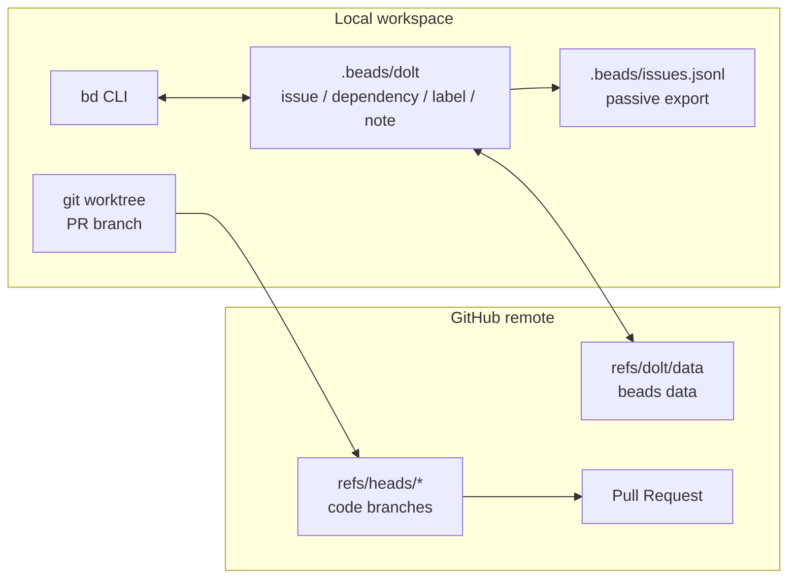
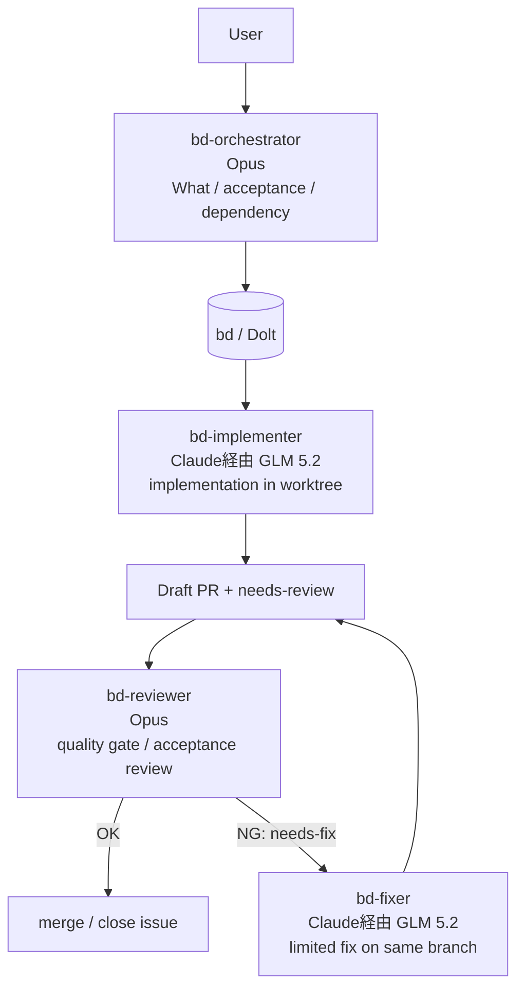
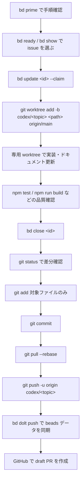

# Kasane Studio

Gemini（`gemini-2.5-flash-image` / nano banana）を使った広告画像オーサリング PWA。
**「生成」と「配置・微調整」を分離**し、プロンプトガチャを消すことを目的とする。

- Gemini は「パーツの見た目生成」と「写真全体の加工」に専念
- 配置 / 移動 / 拡縮 / 回転 / 透過 は **ローカルのレイヤーキャンバスで即時・API 不要**
- `StyleSpec`（雰囲気）を一度設定すれば全パーツ生成に自動注入され、既存パーツを参照画像化して統一感を出せる
- ユーザーは自由文ではなくフィールド入力 → アプリが決定論的にプロンプトを組み立てて再現性を担保

> **確定方針**: PWA（Mac / iPad）。**デプロイは行わない**（BYOK でローカル完結）。LLM は **BYOK**（まず Gemini のみ）。

詳細なプロジェクト方針と AI agent 向けの作業規約は [CLAUDE.md](./CLAUDE.md) と [AGENTS.md](./AGENTS.md) を参照。

---

## 必要環境

- **Node.js 22.x**（動作確認: v22.14.0）
- npm（リポジトリ同梱の `package-lock.json` を使用）

## セットアップ

```bash
npm install
```

## スクリプト

| コマンド | 内容 |
| --- | --- |
| `npm run dev` | Vite 開発サーバー起動（既定で `--host` 相当 = 全インターフェースでリッスン） |
| `npm run build` | 型チェック (`tsc`) + PWA 本番ビルド |
| `npm run preview` | 本番ビルドをローカルでプレビュー |
| `npm test` | Vitest を 1 回実行 |
| `npm run test:watch` | Vitest を watch モードで実行 |

> `vite.config.ts` の `server.host: true` により、`npm run dev` 単体でも同一 LAN からのアクセスを受け付けます。後述の **`npm run dev -- --host`** の明示形式を標準運用とします（Network URL の表示が確実なため）。

## ローカル開発・実機での動作確認

このプロジェクトは **クラウドへのデプロイを行わず、ローカルの dev server を Mac / iPad 実機で開いて** レビュー・動作確認します。

### 1. dev server を起動する

```bash
npm run dev -- --host
```

起動すると、以下のように複数の URL が表示されます。

```
  VITE v5.x  ready in xxx ms

  ➜  Local:   http://localhost:5173/
  ➜  Network: http://192.168.x.x:5173/   ← これを実機で開く
```

### 2. Mac で確認する

- ブラウザで `Local:` の URL（`http://localhost:5173/`）を開く。

### 3. iPad / 別端末で確認する（同一 LAN 必須）

1. **iPad を Mac と同じ Wi-Fi ネットワークに接続**する。
2. iPad の Safari 等で、ターミナルに表示された **`Network:` URL**（例: `http://192.168.x.x:5173/`）を入力する。
3. アプリ画面が表示されれば OK。

> **トラブルシュート**: iPad で開けない場合は、Mac と iPad が同じ Wi-Fi に接続されているか確認してください。職場ネットワーク等でクライアント分離（AP isolation）が有効な場合は、テザリングやモバイルルーター等の別ネットワークをお試しください。

### 4. PWA としてホーム画面に追加（任意）

iPad / iPhone で開いた状態で **共有 → ホーム画面に追加**。以降はスタンドアロンアプリとして起動できます（manifest は `vite.config.ts` で設定済み）。

---

## 技術スタック

React + TypeScript + Vite / `vite-plugin-pwa` / Konva.js + react-konva（レイヤー & Transformer）/
Zustand / Dexie（IndexedDB） / `@imgly/background-removal` / Gemini は `:generateContent` の薄ラッパ。

## プロジェクト構成

```
src/
  types.ts                 # 共通型
  state/store.ts           # Zustand ストア
  db/db.ts                 # Dexie(IndexedDB) スキーマ
  gemini/{client,prompt}.ts
  style/presets.ts
  bg/removeBackground.ts
  canvas/{CanvasStage,LayerNode}.tsx   # react-konva + Transformer
  panels/{Style,AddPart,Layers,Inspector,Settings}.tsx
  export/exportImage.ts
  App.tsx  main.tsx
```

---

## 開発フロー

このリポジトリでは作業管理に `bd` (beads) を使う。通常の作業は、issue を claim してから **PR ごとに専用の git worktree** を作り、他のローカル環境や未完了作業と分離して進める。

```bash
bd ready            # 着手可能なタスクを表示
bd show <id>        # 詳細
bd update <id> --claim
bd close <id>
```

PR を作成する際は `.github/PULL_REQUEST_TEMPLATE.md` が自動的に展開されます。**動作確認手順（ローカル dev）** 欄に従って、実機での確認結果を記載してください。

## ワークフローアーキテクチャ

このプロジェクトの作業状態は git の working tree ではなく、`bd` とその背後の Dolt DB に集約する。コード変更は通常の git branch / PR で扱い、issue・依存・レビュー状態は Dolt の `refs/dolt/data` で同期する。`.beads/issues.jsonl` は確認用の passive export であり、通常の同期経路ではない。



エージェント間の受け渡しも `bd` に置く。オーケストレーターが acceptance criteria と依存を作り、実装者が worktree で PR を出し、レビュワーが `needs-review` / `needs-fix` のラベルで合否を戻す。状態が `bd` に残るため、別コンテキスト・別モデル・別 worktree でも同じ基準で継続できる。



モデル割り当ての狙いはコスト効率。要件分解・受け入れ条件・レビュー判断のように誤判定のコストが高い工程は Opus に寄せ、実装・差し戻し修正のように worktree と品質ゲートで検証しやすい工程は Claude 経由の GLM 5.2 に寄せる。高価なモデルは「何を作るか」「通してよいか」に集中し、量が増えやすい作業は安価なモデルに fan-out できる設計にしている。

## PR 作成フロー



### 1. issue を選んで claim する

```bash
bd prime
bd ready
bd show <id>
bd update <id> --claim
```

新しく見つけた作業は ad-hoc な TODO ではなく、先に `bd create` で issue 化する。

### 2. PR 用の worktree を作る

PR は既存 checkout で直接作らず、専用 worktree で作業する。既存の未コミット変更や別 issue の作業を混ぜないため。

```bash
git fetch origin
git worktree add -b codex/<topic> /private/tmp/design-tool-<topic> origin/main
cd /private/tmp/design-tool-<topic>
```

既存 branch から続ける場合も、作業場所は専用 worktree にする。

```bash
git worktree add /private/tmp/design-tool-<topic> codex/<topic>
```

### 3. 実装して検証する

変更後は差分に応じて必要な品質確認を実行する。

```bash
npm test
npm run build
```

ドキュメントだけの変更でも、少なくとも `git diff --check` で Markdown の不要な空白や基本的な差分を確認する。

### 4. bd と git を更新する

完了した issue は close してから、今回の PR に含めるファイルだけを stage する。

```bash
bd close <id>
git status --short
git add README.md .beads/issues.jsonl
git commit -m "docs: document development workflow"
git pull --rebase
git push -u origin codex/<topic>
bd dolt push
```

`.beads/issues.jsonl` は passive export だが、bd 操作で更新された場合は通常のコード差分と同じく確認して commit 対象を判断する。Dolt 側の同期は `bd dolt push` で行う。

### 5. draft PR を作る

push 後、GitHub 上で draft PR を作成する。PR 本文には次を含める。

- 変更内容
- 変更理由
- 検証内容
- 対象 issue

PR 作成後も main checkout に戻って作業を混ぜず、レビュー対応は同じ worktree/branch で行う。
