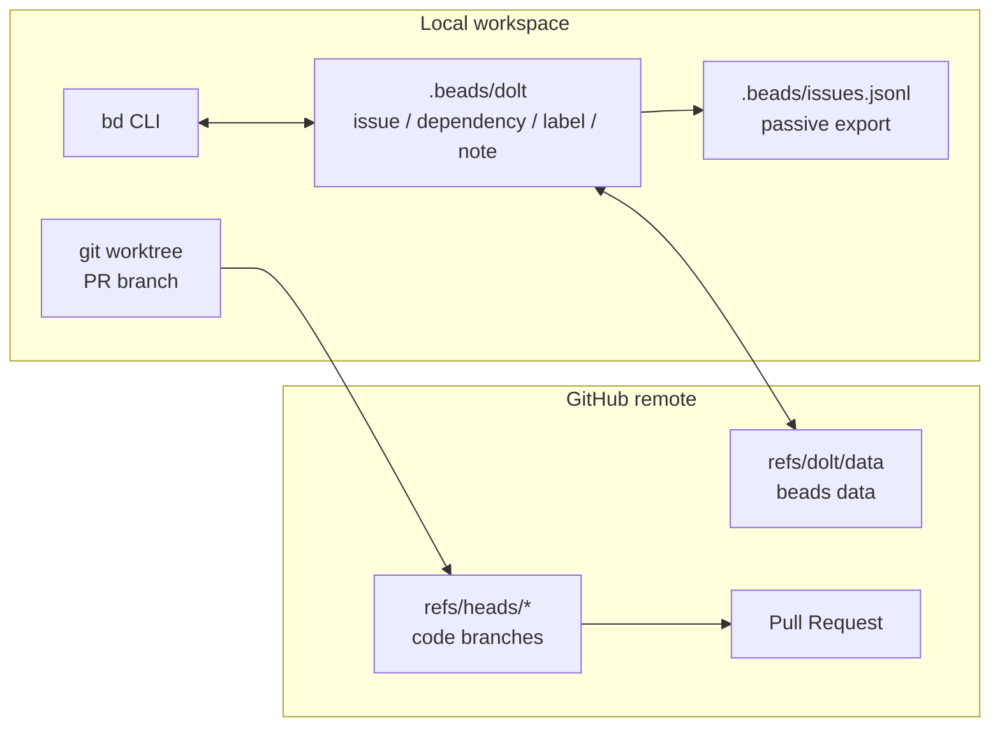
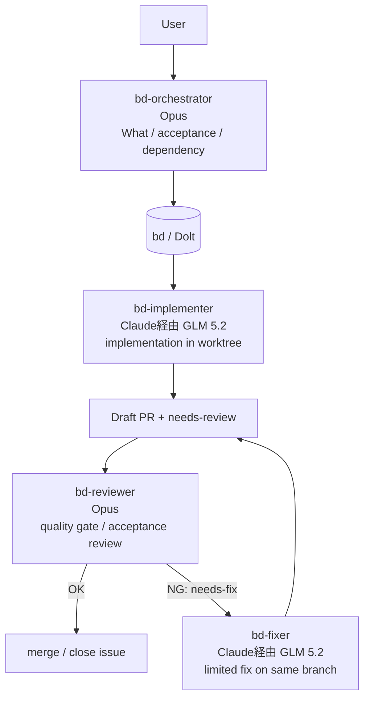
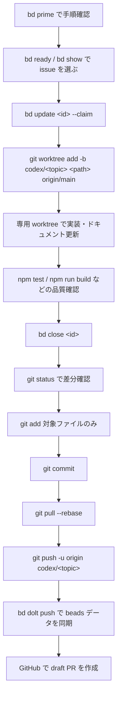

# Kasane Studio

Gemini を使った広告画像オーサリング PWA。生成と配置・微調整を分離し、ローカルのレイヤーキャンバスで再現性のある編集体験を作る。

詳細なプロジェクト方針と AI agent 向けの作業規約は [CLAUDE.md](./CLAUDE.md) と [AGENTS.md](./AGENTS.md) を参照。

## 開発フロー

このリポジトリでは作業管理に `bd` (beads) を使う。通常の作業は、issue を claim してから **PR ごとに専用の git worktree** を作り、他のローカル環境や未完了作業と分離して進める。

## ワークフローアーキテクチャ

このプロジェクトの作業状態は git の working tree ではなく、`bd` とその背後の Dolt DB に集約する。コード変更は通常の git branch / PR で扱い、issue・依存・レビュー状態は Dolt の `refs/dolt/data` で同期する。`.beads/issues.jsonl` は確認用の passive export であり、通常の同期経路ではない。



エージェント間の受け渡しも `bd` に置く。オーケストレーターが acceptance criteria と依存を作り、実装者が worktree で PR を出し、レビュワーが `needs-review` / `needs-fix` のラベルで合否を戻す。状態が `bd` に残るため、別コンテキスト・別モデル・別 worktree でも同じ基準で継続できる。



モデル割り当ての狙いはコスト効率。要件分解・受け入れ条件・レビュー判断のように誤判定のコストが高い工程は Opus に寄せ、実装・差し戻し修正のように worktree と品質ゲートで検証しやすい工程は Claude 経由の GLM 5.2 に寄せる。高価なモデルは「何を作るか」「通してよいか」に集中し、量が増えやすい作業は安価なモデルに fan-out できる設計にしている。

## PR 作成フロー



### 1. issue を選んで claim する

```bash
bd prime
bd ready
bd show <id>
bd update <id> --claim
```

新しく見つけた作業は ad-hoc な TODO ではなく、先に `bd create` で issue 化する。

### 2. PR 用の worktree を作る

PR は既存 checkout で直接作らず、専用 worktree で作業する。既存の未コミット変更や別 issue の作業を混ぜないため。

```bash
git fetch origin
git worktree add -b codex/<topic> /private/tmp/design-tool-<topic> origin/main
cd /private/tmp/design-tool-<topic>
```

既存 branch から続ける場合も、作業場所は専用 worktree にする。

```bash
git worktree add /private/tmp/design-tool-<topic> codex/<topic>
```

### 3. 実装して検証する

変更後は差分に応じて必要な品質確認を実行する。

```bash
npm test
npm run build
```

ドキュメントだけの変更でも、少なくとも `git diff --check` で Markdown の不要な空白や基本的な差分を確認する。

### 4. bd と git を更新する

完了した issue は close してから、今回の PR に含めるファイルだけを stage する。

```bash
bd close <id>
git status --short
git add README.md .beads/issues.jsonl
git commit -m "docs: document development workflow"
git pull --rebase
git push -u origin codex/<topic>
bd dolt push
```

`.beads/issues.jsonl` は passive export だが、bd 操作で更新された場合は通常のコード差分と同じく確認して commit 対象を判断する。Dolt 側の同期は `bd dolt push` で行う。

### 5. draft PR を作る

push 後、GitHub 上で draft PR を作成する。PR 本文には次を含める。

- 変更内容
- 変更理由
- 検証内容
- 対象 issue

PR 作成後も main checkout に戻って作業を混ぜず、レビュー対応は同じ worktree/branch で行う。
